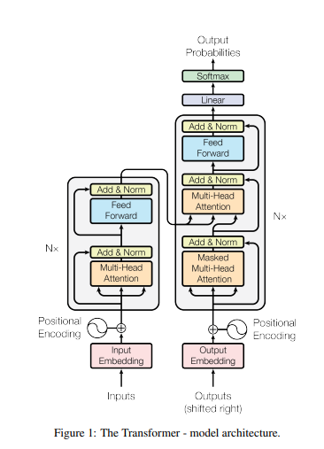
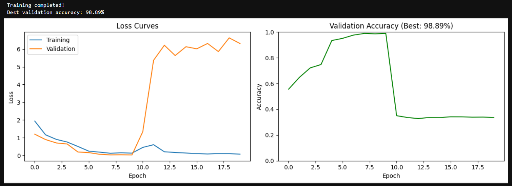
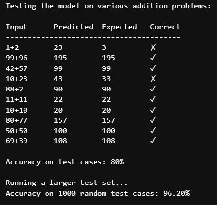

# transformers_scratch
## Implementing Transformers from scratch with the paper "Attention is all you need" as reference
Used only basic modules from PyTorch and created classes for PositionalEncoding, MultiHeadAttention, PositionWiseFeedForward, EncoderLayer, DecoderLayer, and the Transformer 

## Results

### Addition of Two Two-Digit Numbers
The transformer model achieves the following performance:

| Metric          | Accuracy |
|-----------------|----------|
| **Validation**  | 98.89%   |
| **Test**        | 96.20%   |

This demonstrates strong generalization capabilities for arithmetic operations while maintaining high precision on unseen data.

|  |  |
